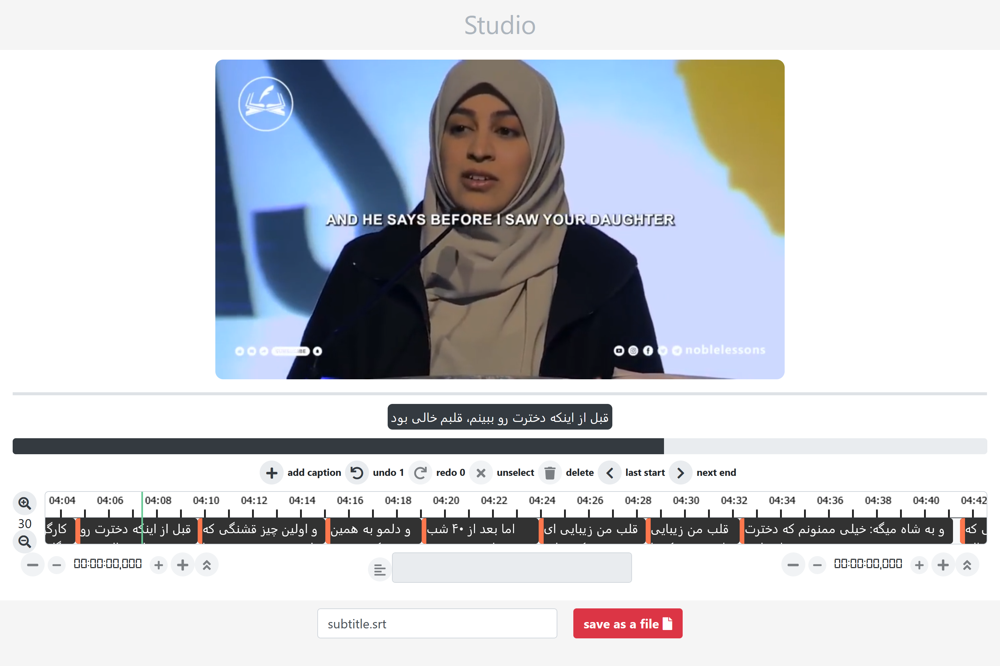

# web based subtitle editor
> health and safety are 2 forgotten gifts among people - Muhammad the prophet 

## demo
you can see demo [here](https://hamidb80.github.io/subtitle-editor/)

## features
* shortcuts/mouse
* undo/redo
* nice ux/ui [native components - no external UI libraries]
* loads resources with query params `http://APP?video=URL&subtitle=URL` where `APP` is demo url

## commands:
`npm install yarn`
if you dont have Yarn:

`yarn install`
install dependencies

`yarn start`
Runs the app in the development mode.

`yarn build`
Builds the app for production to the `build` folder.
